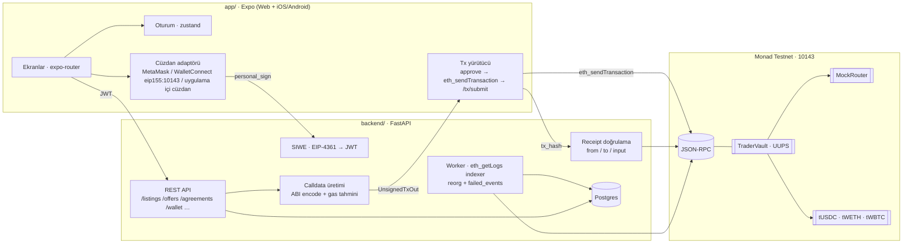

# TraderKirala

Freelance trader'ları sermaye sahipleriyle buluşturan, sözleşme ve escrow'u **Monad** üzerinde tutan mobil-öncelikli uygulama.

> Yatırım ve komisyon getirileri piyasa koşullarına bağlıdır, sermaye kaybı riski içerir.

## Repo yapısı (monorepo)

```
traderkirala/
├── app/          Expo + React Native (Expo Web birincil, iOS/Android Expo Go) — viem/wagmi, SIWE, WalletConnect
├── backend/      FastAPI + Postgres + worker (indexer/reconciler) — web3.py ile Monad RPC
├── contracts/    Solidity (Foundry) — TraderVault (UUPS), MockRouter, TestToken
├── docs/         Tasarım sistemi, API sözleşmesi, geçiş dokümanları (docs/monad/)
└── SPRINT-2-MONAD.md  Sprint planı
```

## Ağ ve kontratlar (Monad Testnet, chainId 10143)

| Kontrat | Adres | Doğrulama |
|---|---|---|
| TraderVault (proxy) | [`0xBA08F3Fd93837408EfBCe300826f6a75181624e3`](https://testnet.monadvision.com/address/0xBA08F3Fd93837408EfBCe300826f6a75181624e3) | Sourcify ✅ |
| TraderVault (implementation) | `0x9A55fE0356BFAcae177914b7D35f336FFf971d4F` | Sourcify ✅ |
| MockRouter (UniswapV2 arayüzü) | `0x62467f7c7F0f25CCdE0059D89d6e72524bC2cf95` | Sourcify ✅ |
| tUSDC (6 ondalık, taban varlık) | `0x783D4800fdC2Cea696ed61a12747737E8eA7045d` | Sourcify ✅ |
| tWETH (18) | `0xB8B2457fC6443F94DbDbe8618f14d181eEDC4492` | Sourcify ✅ |
| tWBTC (8) | `0x530aDB5222F9b9372b65fBE799bb3dD1eb11062a` | Sourcify ✅ |

Deploy bloğu 65.874.950 · tam çıktı: `contracts/deployments/monad-testnet.json`.
RPC `https://testnet-rpc.monad.xyz` · Explorer `https://testnet.monadvision.com` · Faucet `https://faucet.monad.xyz` · Ağ bilgileri: [docs/monad/06-monad-testnet.md](docs/monad/06-monad-testnet.md).

## Mimari



**Çekirdek akış:** SIWE ile giriş ve rol → ilan (capital ilanında `reserve` ile tUSDC kilitleme) → teklif → sözleşme (`open`/`propose` + `accept`) → trader `trade` (router üzerinden swap, drawdown tabanı) → `settle` (bölüşüm: kâr üzerinden komisyon, zararda fee yok) → `claim`.

**İşlem modeli:** Backend imzasız işlem verisini (`to`, `data`, `value`, `gas`, gerekirse `approve` ön adımı) üretir; cüzdan işlemi kendisi gönderir; uygulama `tx_hash`'i backend'e bildirir; backend receipt'te `from/to/input` eşleşmesini doğrular ve olayları işler. Özel anahtar hiçbir adımda sunucuya gitmez.

## Kontrat özeti (`contracts/`)

- `TraderVault.sol`: rezervasyon (`reserve`/`release`/`releaseAll`), sözleşme yaşam döngüsü (`propose`/`open`/`openReserved`/`fund`/`fundReserved`/`accept`/`cancel`), `trade` (allow-list, en fazla 6 token, slippage, drawdown), üç kademeli `settle` (taraflar / owner süre sonunda / herkes +7 gün), in-kind dust ve `claim`, pause, iki adımlı router değişimi, fee snapshot; OpenZeppelin UUPS + Ownable2Step + ReentrancyGuard + SafeERC20.
- `MockRouter.sol`: UniswapV2 `getAmountsOut` / `swapExactTokensForTokens` alt kümesi, sabit fiyatlar.
- `TestToken.sol`: ERC-20 + `decimals` + `MINTER_ROLE` (faucet).
- Testler: 89 Foundry testi (birim, fuzz, invariant, reentrancy, upgrade), TraderVault %100 satır kapsamı.

## Hızlı başlangıç

### Kontratlar
```bash
cd contracts
make setup          # forge install (OpenZeppelin, forge-std)
forge build && forge test
scripts/anvil-local.sh              # yerel anvil'e deploy (deployments/anvil-local.json)
source ~/.config/traderkirala/monad-testnet-deployer.env && scripts/deploy-testnet.sh   # testnet
```

### Backend
```bash
cd backend
cp .env.example .env    # CHAIN_ID, RPC_URL, VAULT_ADDRESS, ROUTER_ADDRESS, SIWE_*, MINTER_PRIVATE_KEY (faucet)
docker compose up -d    # db + api (127.0.0.1:8013) + worker ; ya da yerelde:
uv venv --python 3.12 .venv && uv pip install --python .venv/bin/python -r requirements-dev.txt
.venv/bin/alembic upgrade head && .venv/bin/python -m scripts.seed_assets --file ../contracts/deployments/monad-testnet.json
.venv/bin/uvicorn app.main:app --port 8013
```
Şema: `http://127.0.0.1:8013/docs` · sözleşme: [docs/monad/02-api-sozlesme.md](docs/monad/02-api-sozlesme.md).

### Frontend
```bash
cd app
cp .env.example .env    # EXPO_PUBLIC_API_BASE_URL, EXPO_PUBLIC_CHAIN_ID=10143, EXPO_PUBLIC_WALLETCONNECT_PROJECT_ID (opsiyonel)
npm install
npm run web             # http://localhost:8081 — MetaMask'ı Monad Testnet'e alın (uygulama ağı eklemeyi teklif eder)
npm run gen:api         # backend ayaktayken OpenAPI'den tipleri üretir
```
Mobil: Expo Go ile açın; uygulama içi cüzdan (cihazda anahtar, `expo-secure-store`) veya WalletConnect ile MetaMask/Rainbow/Trust. Adımlar: [docs/mobil-test.md](docs/mobil-test.md).

Diğer komutlar: `npm run check` (typecheck + lint), `npm run export:web`.

## Entegrasyonlar

| Alan | Kullanım |
|---|---|
| Kimlik | SIWE (EIP-4361): sunucu mesajı üretir, cüzdan `personal_sign`, backend `ecrecover` + nonce/domain/chainId doğrulaması → JWT |
| Cüzdan | Web: wagmi/viem (injected EIP-6963, WalletConnect); Mobil: WalletConnect `eip155:10143` + uygulama içi cüzdan (viem) |
| Kontrat çağrısı | Backend ABI encode (web3.py) → `UnsignedTxOut` → cüzdan `eth_sendTransaction` |
| Token onayı | ERC-20 `approve` ön adımı (tam tutar), sonra `transferFrom` |
| Veri | Worker `eth_getLogs` ile TraderVault olaylarını indeksler; onay derinliği ve reorg koruması; reconciler zincir üstü değerle DB'yi eşler |
| Test tokenı | `POST /wallet/faucet` → backend minter anahtarı `TestToken.mint` |
| Doğrulama | Sourcify (Monad), MonadVision / Monadscan explorer |

## Belgeler

- [SPRINT-2-MONAD.md](SPRINT-2-MONAD.md) — sprint planı ve görevler
- [docs/monad/](docs/monad/) — kontrat spec (01), API sözleşmesi (02), backend (03) ve frontend (04) tasarımı, testnet bilgileri (06), durum (07)
- [docs/design-system.md](docs/design-system.md) — Figma tasarım sistemi ↔ kod eşlemesi
- Figma: `6ZxzvsYKarDglg0PGYRIgP` — TraderKirala Mobil Tasarım Sistemi

## Güvenlik notları

- Deployer/owner anahtarı sunucuda tutulmaz; admin işlemleri operatör cüzdanından yapılır. Sunucuda yalnız düşük yetkili minter anahtarı (test tokenı faucet) bulunur.
- Bilinen ve kabul edilen testnet riskleri: değerleme spot router fiyatıyla yapılır (drawdown tek işlemde atlatılabilir; mainnet öncesi oracle/TWAP gerekir); keeper settle yolu in-kind'a düşen tokenlarda kilitlenebilir. Ayrıntı: `docs/monad/01-kontrat-spec.md` §11.
